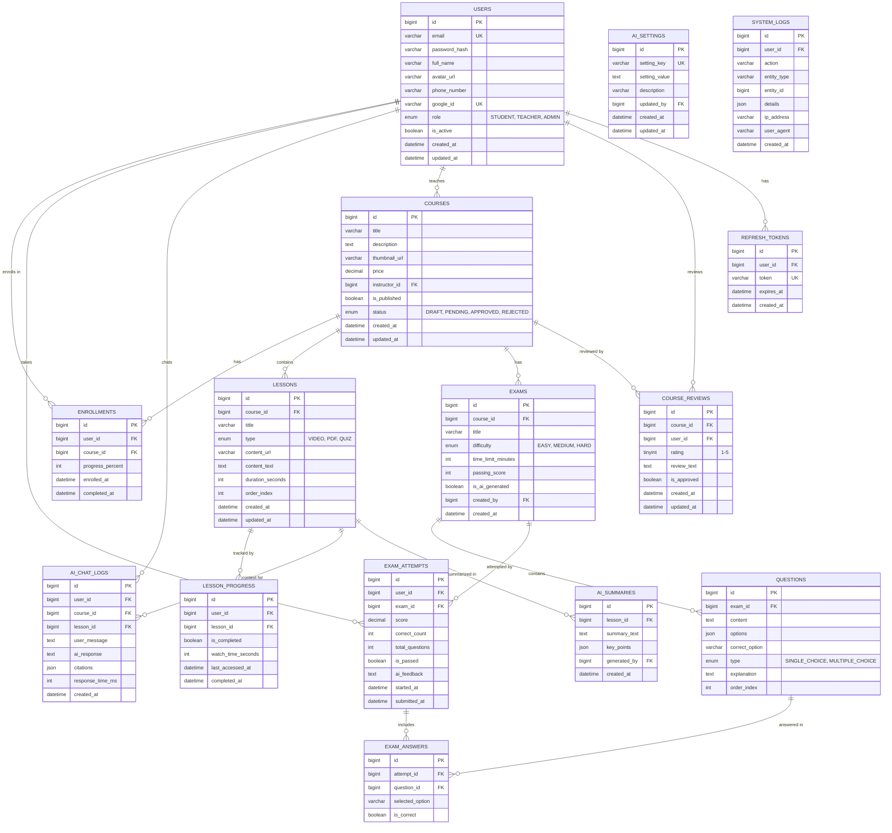

# 🗄️ ThinkAI - Database Schema Design

**Version:** 1.1.0  
**Last Updated:** 2026-01-30  
**Database:** MySQL 8.0  
**SQL File:** [thinkai_schema.sql](database/thinkai_schema.sql)

---

## 1. Entity Relationship Diagram (ERD)



---

## 2. Chi Tiết Bảng Dữ Liệu

### 2.1. `users` - Người dùng

| Column          | Type         | Constraints        | Description                   |
| --------------- | ------------ | ------------------ | ----------------------------- |
| `id`            | BIGINT       | PK, AUTO_INCREMENT | ID người dùng                 |
| `email`         | VARCHAR(255) | UNIQUE, NOT NULL   | Email đăng nhập               |
| `password_hash` | VARCHAR(255) | NOT NULL           | Mật khẩu mã hóa BCrypt        |
| `full_name`     | VARCHAR(100) | NOT NULL           | Họ tên đầy đủ                 |
| `avatar_url`    | VARCHAR(500) | NULL               | URL ảnh đại diện              |
| `phone_number`  | VARCHAR(20)  | NULL               | Số điện thoại                 |
| `role`          | ENUM         | NOT NULL           | `STUDENT`, `TEACHER`, `ADMIN` |
| `is_active`     | BOOLEAN      | DEFAULT TRUE       | Trạng thái tài khoản          |
| `created_at`    | DATETIME     | NOT NULL           | Ngày tạo                      |
| `updated_at`    | DATETIME     | NOT NULL           | Ngày cập nhật                 |

**Indexes:**

- `idx_users_email` ON `email`
- `idx_users_role` ON `role`

---

### 2.2. `courses` - Khóa học

| Column          | Type          | Constraints        | Description    |
| --------------- | ------------- | ------------------ | -------------- |
| `id`            | BIGINT        | PK, AUTO_INCREMENT | ID khóa học    |
| `title`         | VARCHAR(255)  | NOT NULL           | Tên khóa học   |
| `description`   | TEXT          | NULL               | Mô tả chi tiết |
| `thumbnail_url` | VARCHAR(500)  | NULL               | Ảnh thumbnail  |
| `price`         | DECIMAL(10,2) | DEFAULT 0          | Giá (VND)      |
| `instructor_id` | BIGINT        | FK → users.id      | Giảng viên     |
| `is_published`  | BOOLEAN       | DEFAULT FALSE      | Đã xuất bản    |
| `created_at`    | DATETIME      | NOT NULL           | Ngày tạo       |
| `updated_at`    | DATETIME      | NOT NULL           | Ngày cập nhật  |

**Indexes:**

- `idx_courses_instructor` ON `instructor_id`
- `idx_courses_published` ON `is_published`
- `FULLTEXT idx_courses_search` ON (`title`, `description`)

---

### 2.3. `lessons` - Bài học

| Column             | Type         | Constraints        | Description                    |
| ------------------ | ------------ | ------------------ | ------------------------------ |
| `id`               | BIGINT       | PK, AUTO_INCREMENT | ID bài học                     |
| `course_id`        | BIGINT       | FK → courses.id    | Khóa học chứa bài              |
| `title`            | VARCHAR(255) | NOT NULL           | Tên bài học                    |
| `type`             | ENUM         | NOT NULL           | `VIDEO`, `PDF`, `QUIZ`         |
| `content_url`      | VARCHAR(500) | NULL               | URL video/PDF                  |
| `content_text`     | TEXT         | NULL               | Nội dung text (cho AI context) |
| `duration_seconds` | INT          | DEFAULT 0          | Thời lượng (giây)              |
| `order_index`      | INT          | NOT NULL           | Thứ tự trong khóa học          |
| `created_at`       | DATETIME     | NOT NULL           | Ngày tạo                       |
| `updated_at`       | DATETIME     | NOT NULL           | Ngày cập nhật                  |

**Indexes:**

- `idx_lessons_course` ON `course_id`
- `idx_lessons_order` ON (`course_id`, `order_index`)

---

### 2.4. `enrollments` - Đăng ký học

| Column             | Type     | Constraints        | Description     |
| ------------------ | -------- | ------------------ | --------------- |
| `id`               | BIGINT   | PK, AUTO_INCREMENT | ID đăng ký      |
| `user_id`          | BIGINT   | FK → users.id      | Học viên        |
| `course_id`        | BIGINT   | FK → courses.id    | Khóa học        |
| `progress_percent` | INT      | DEFAULT 0          | Tiến độ (0-100) |
| `enrolled_at`      | DATETIME | NOT NULL           | Ngày đăng ký    |
| `completed_at`     | DATETIME | NULL               | Ngày hoàn thành |

**Indexes:**

- `UNIQUE idx_enrollment_unique` ON (`user_id`, `course_id`)

---

### 2.5. `lesson_progress` - Tiến độ bài học

| Column               | Type     | Constraints        | Description       |
| -------------------- | -------- | ------------------ | ----------------- |
| `id`                 | BIGINT   | PK, AUTO_INCREMENT | ID                |
| `user_id`            | BIGINT   | FK → users.id      | Học viên          |
| `lesson_id`          | BIGINT   | FK → lessons.id    | Bài học           |
| `is_completed`       | BOOLEAN  | DEFAULT FALSE      | Đã hoàn thành     |
| `watch_time_seconds` | INT      | DEFAULT 0          | Thời gian xem     |
| `last_accessed_at`   | DATETIME | NULL               | Lần truy cập cuối |
| `completed_at`       | DATETIME | NULL               | Ngày hoàn thành   |

**Indexes:**

- `UNIQUE idx_progress_unique` ON (`user_id`, `lesson_id`)

---

### 2.6. `exams` - Bài thi

| Column               | Type         | Constraints        | Description              |
| -------------------- | ------------ | ------------------ | ------------------------ |
| `id`                 | BIGINT       | PK, AUTO_INCREMENT | ID bài thi               |
| `course_id`          | BIGINT       | FK → courses.id    | Khóa học                 |
| `title`              | VARCHAR(255) | NOT NULL           | Tên bài thi              |
| `difficulty`         | ENUM         | NOT NULL           | `EASY`, `MEDIUM`, `HARD` |
| `time_limit_minutes` | INT          | DEFAULT 30         | Thời gian làm bài        |
| `passing_score`      | INT          | DEFAULT 60         | Điểm đạt (%)             |
| `is_ai_generated`    | BOOLEAN      | DEFAULT FALSE      | Tạo bởi AI               |
| `created_at`         | DATETIME     | NOT NULL           | Ngày tạo                 |

**Indexes:**

- `idx_exams_course` ON `course_id`

---

### 2.7. `questions` - Câu hỏi

| Column           | Type        | Constraints        | Description                        |
| ---------------- | ----------- | ------------------ | ---------------------------------- |
| `id`             | BIGINT      | PK, AUTO_INCREMENT | ID câu hỏi                         |
| `exam_id`        | BIGINT      | FK → exams.id      | Bài thi                            |
| `content`        | TEXT        | NOT NULL           | Nội dung câu hỏi                   |
| `options`        | JSON        | NOT NULL           | Các đáp án `["A", "B", "C", "D"]`  |
| `correct_option` | VARCHAR(10) | NOT NULL           | Đáp án đúng                        |
| `type`           | ENUM        | NOT NULL           | `SINGLE_CHOICE`, `MULTIPLE_CHOICE` |
| `explanation`    | TEXT        | NULL               | Giải thích đáp án                  |
| `order_index`    | INT         | NOT NULL           | Thứ tự câu hỏi                     |

**Indexes:**

- `idx_questions_exam` ON `exam_id`

---

### 2.8. `exam_attempts` - Lịch sử làm bài

| Column            | Type         | Constraints        | Description     |
| ----------------- | ------------ | ------------------ | --------------- |
| `id`              | BIGINT       | PK, AUTO_INCREMENT | ID lần thi      |
| `user_id`         | BIGINT       | FK → users.id      | Học viên        |
| `exam_id`         | BIGINT       | FK → exams.id      | Bài thi         |
| `score`           | DECIMAL(5,2) | NULL               | Điểm số         |
| `correct_count`   | INT          | DEFAULT 0          | Số câu đúng     |
| `total_questions` | INT          | NOT NULL           | Tổng số câu     |
| `ai_feedback`     | TEXT         | NULL               | Nhận xét AI     |
| `started_at`      | DATETIME     | NOT NULL           | Bắt đầu làm bài |
| `submitted_at`    | DATETIME     | NULL               | Nộp bài         |

**Indexes:**

- `idx_attempts_user` ON `user_id`
- `idx_attempts_exam` ON `exam_id`

---

### 2.9. `exam_answers` - Chi tiết câu trả lời

| Column            | Type        | Constraints           | Description    |
| ----------------- | ----------- | --------------------- | -------------- |
| `id`              | BIGINT      | PK, AUTO_INCREMENT    | ID             |
| `attempt_id`      | BIGINT      | FK → exam_attempts.id | Lần thi        |
| `question_id`     | BIGINT      | FK → questions.id     | Câu hỏi        |
| `selected_option` | VARCHAR(10) | NULL                  | Đáp án đã chọn |
| `is_correct`      | BOOLEAN     | DEFAULT FALSE         | Đúng/Sai       |

**Indexes:**

- `UNIQUE idx_answer_unique` ON (`attempt_id`, `question_id`)

---

### 2.10. `ai_chat_logs` - Log chat AI

| Column         | Type     | Constraints        | Description        |
| -------------- | -------- | ------------------ | ------------------ |
| `id`           | BIGINT   | PK, AUTO_INCREMENT | ID                 |
| `user_id`      | BIGINT   | FK → users.id      | Người dùng         |
| `course_id`    | BIGINT   | FK → courses.id    | Khóa học context   |
| `lesson_id`    | BIGINT   | FK → lessons.id    | Bài học context    |
| `user_message` | TEXT     | NOT NULL           | Câu hỏi người dùng |
| `ai_response`  | TEXT     | NOT NULL           | Câu trả lời AI     |
| `citations`    | JSON     | NULL               | Trích dẫn nguồn    |
| `created_at`   | DATETIME | NOT NULL           | Thời gian          |

**Indexes:**

- `idx_chat_user` ON `user_id`
- `idx_chat_lesson` ON `lesson_id`
- `idx_chat_created` ON `created_at`

---

## 3. Foreign Key Constraints

```sql
-- Courses
ALTER TABLE courses
  ADD CONSTRAINT fk_courses_instructor
  FOREIGN KEY (instructor_id) REFERENCES users(id) ON DELETE SET NULL;

-- Lessons
ALTER TABLE lessons
  ADD CONSTRAINT fk_lessons_course
  FOREIGN KEY (course_id) REFERENCES courses(id) ON DELETE CASCADE;

-- Enrollments
ALTER TABLE enrollments
  ADD CONSTRAINT fk_enrollments_user
  FOREIGN KEY (user_id) REFERENCES users(id) ON DELETE CASCADE;
ALTER TABLE enrollments
  ADD CONSTRAINT fk_enrollments_course
  FOREIGN KEY (course_id) REFERENCES courses(id) ON DELETE CASCADE;

-- Lesson Progress
ALTER TABLE lesson_progress
  ADD CONSTRAINT fk_progress_user
  FOREIGN KEY (user_id) REFERENCES users(id) ON DELETE CASCADE;
ALTER TABLE lesson_progress
  ADD CONSTRAINT fk_progress_lesson
  FOREIGN KEY (lesson_id) REFERENCES lessons(id) ON DELETE CASCADE;

-- Exams
ALTER TABLE exams
  ADD CONSTRAINT fk_exams_course
  FOREIGN KEY (course_id) REFERENCES courses(id) ON DELETE CASCADE;

-- Questions
ALTER TABLE questions
  ADD CONSTRAINT fk_questions_exam
  FOREIGN KEY (exam_id) REFERENCES exams(id) ON DELETE CASCADE;

-- Exam Attempts
ALTER TABLE exam_attempts
  ADD CONSTRAINT fk_attempts_user
  FOREIGN KEY (user_id) REFERENCES users(id) ON DELETE CASCADE;
ALTER TABLE exam_attempts
  ADD CONSTRAINT fk_attempts_exam
  FOREIGN KEY (exam_id) REFERENCES exams(id) ON DELETE CASCADE;

-- Exam Answers
ALTER TABLE exam_answers
  ADD CONSTRAINT fk_answers_attempt
  FOREIGN KEY (attempt_id) REFERENCES exam_attempts(id) ON DELETE CASCADE;
ALTER TABLE exam_answers
  ADD CONSTRAINT fk_answers_question
  FOREIGN KEY (question_id) REFERENCES questions(id) ON DELETE CASCADE;

-- AI Chat Logs
ALTER TABLE ai_chat_logs
  ADD CONSTRAINT fk_chat_user
  FOREIGN KEY (user_id) REFERENCES users(id) ON DELETE CASCADE;
ALTER TABLE ai_chat_logs
  ADD CONSTRAINT fk_chat_course
  FOREIGN KEY (course_id) REFERENCES courses(id) ON DELETE SET NULL;
ALTER TABLE ai_chat_logs
  ADD CONSTRAINT fk_chat_lesson
  FOREIGN KEY (lesson_id) REFERENCES lessons(id) ON DELETE SET NULL;
```

---

## 4. Indexing Strategy

| Index Type            | Use Case                               |
| --------------------- | -------------------------------------- |
| **Primary Key**       | Unique identifier, JOIN operations     |
| **Unique Index**      | Prevent duplicates (email, enrollment) |
| **Foreign Key Index** | Relationship queries                   |
| **Composite Index**   | Multi-column WHERE/ORDER BY            |
| **Fulltext Index**    | Search functionality                   |

---

## 5. Data Types Decision

| Decision                   | Rationale                              |
| -------------------------- | -------------------------------------- |
| **BIGINT for IDs**         | Future-proof, supports large scale     |
| **DATETIME vs TIMESTAMP**  | DATETIME for explicit timezone control |
| **ENUM for fixed values**  | Type safety, storage efficiency        |
| **JSON for flexible data** | Dynamic options, citations             |
| **TEXT for long content**  | No VARCHAR limit issues                |
| **DECIMAL for scores**     | Precision for calculations             |
