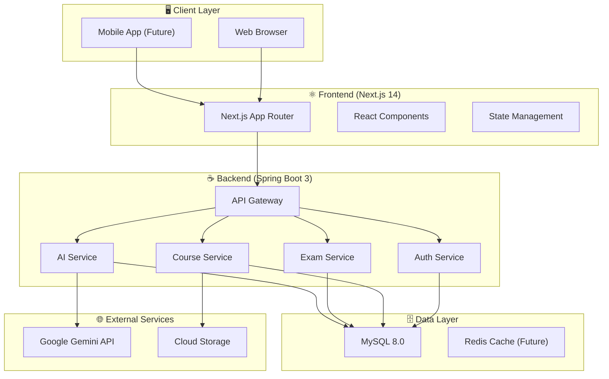
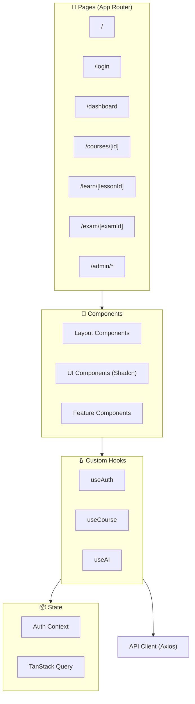
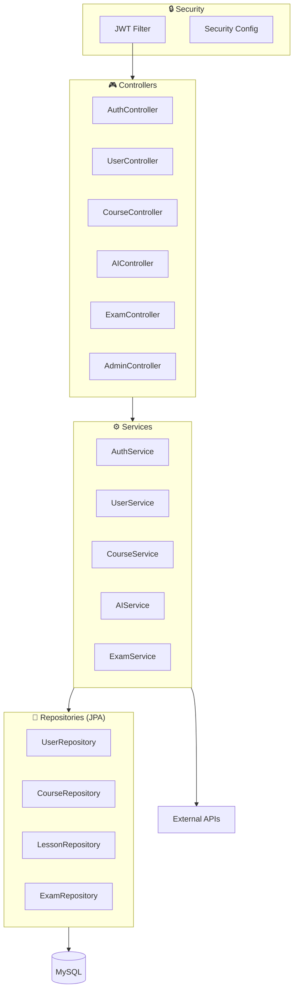
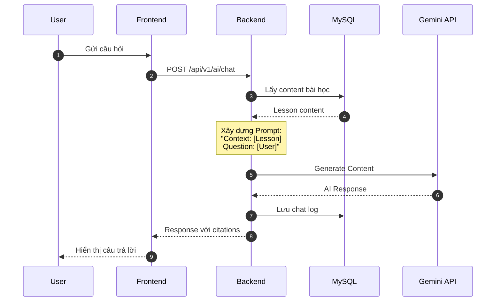
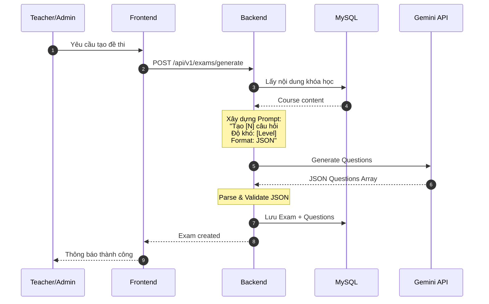
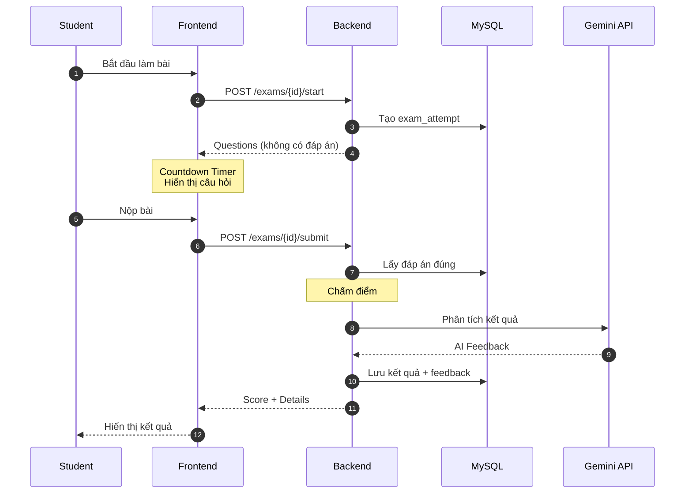
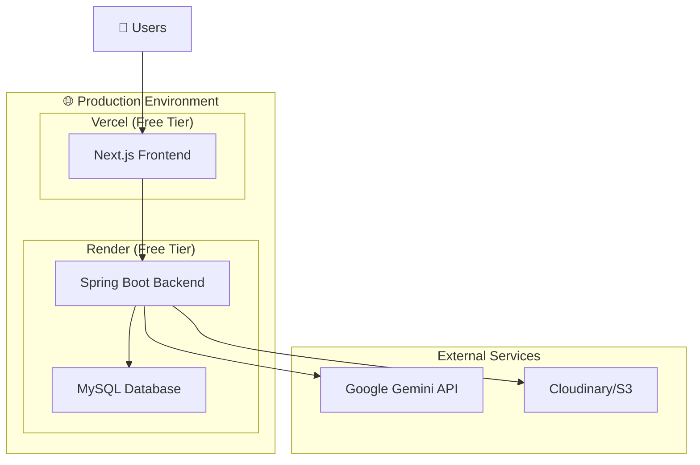
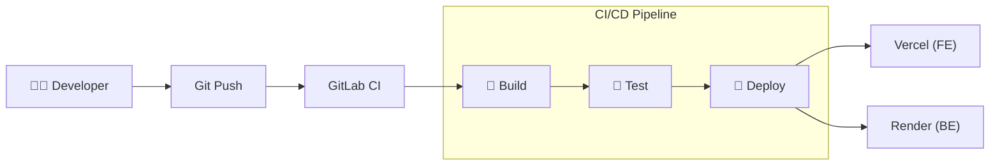
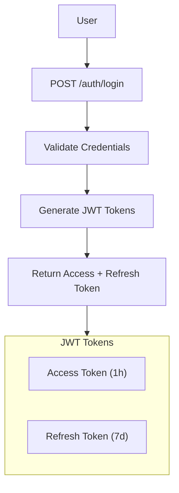

# 🏗 ThinkAI - System Architecture

**Version:** 1.0.0  
**Last Updated:** 2026-01-25

---

## 1. Tổng Quan Kiến Trúc

ThinkAI sử dụng kiến trúc **3-tier (Client-Server-Database)** kết hợp với **AI Service Layer** để xử lý các tính năng thông minh.

### 1.1. High-Level Architecture



---

## 2. Component Architecture

### 2.1. Frontend Architecture (Next.js)



### 2.2. Backend Architecture (Spring Boot)



---

## 3. Luồng Xử Lý Chi Tiết

### 3.1. Luồng AI Tutor (Hỏi Đáp)



### 3.2. Luồng Smart Exam (Tạo Đề Tự Động)



### 3.3. Luồng Làm Bài Thi



---

## 4. Technology Stack Details

### 4.1. Frontend Stack

| Layer           | Technology              | Purpose                    |
| --------------- | ----------------------- | -------------------------- |
| **Framework**   | Next.js 14 (App Router) | SSR, Routing, API Routes   |
| **UI Library**  | React 18                | Component-based UI         |
| **Styling**     | Tailwind CSS            | Utility-first CSS          |
| **Components**  | Shadcn/UI               | Pre-built components       |
| **Icons**       | Lucide React            | Icon library               |
| **State**       | TanStack Query          | Server state management    |
| **HTTP Client** | Axios                   | API requests               |
| **Forms**       | React Hook Form + Zod   | Form handling & validation |

### 4.2. Backend Stack

| Layer          | Technology         | Purpose                        |
| -------------- | ------------------ | ------------------------------ |
| **Framework**  | Spring Boot 3.2    | Application framework          |
| **Security**   | Spring Security 6  | Authentication & Authorization |
| **ORM**        | Spring Data JPA    | Database access                |
| **Validation** | Jakarta Validation | Input validation               |
| **JWT**        | jjwt               | Token management               |
| **Lombok**     | Lombok             | Boilerplate reduction          |
| **API Docs**   | SpringDoc OpenAPI  | Swagger documentation          |

### 4.3. Database Stack

| Component      | Technology     | Purpose                 |
| -------------- | -------------- | ----------------------- |
| **Primary DB** | MySQL 8.0      | Relational data storage |
| **Caching**    | Redis (Future) | Session & query cache   |
| **Search**     | MySQL FULLTEXT | Course search           |

---

## 5. Deployment Architecture



### 5.1. CI/CD Pipeline



---

## 6. Security Architecture

### 6.1. Authentication Flow



### 6.2. Authorization Matrix

| Role        | Courses      | AI Chat | Exams    | Admin   |
| ----------- | ------------ | ------- | -------- | ------- |
| **STUDENT** | View, Enroll | ✅ Use  | Take     | ❌      |
| **TEACHER** | CRUD Own     | ✅ Use  | Create   | ❌      |
| **ADMIN**   | CRUD All     | ✅ Use  | CRUD All | ✅ Full |

---

## 7. Folder Structure

### 7.1. Frontend (`applications/frontend`)

```
src/
├── app/                    # Next.js App Router
│   ├── (auth)/            # Auth route group
│   ├── (main)/            # Main app routes
│   ├── admin/             # Admin routes
│   └── api/               # API routes
├── components/
│   ├── ui/                # Shadcn components
│   ├── layout/            # Layout components
│   └── features/          # Feature components
├── hooks/                 # Custom hooks
├── lib/                   # Utilities
├── services/              # API services
└── types/                 # TypeScript types
```

### 7.2. Backend (`applications/backend`)

```
src/main/java/com/thinkai/
├── config/                # Configuration classes
├── controller/            # REST Controllers
├── service/               # Business logic
├── repository/            # JPA Repositories
├── entity/                # JPA Entities
├── dto/                   # Data Transfer Objects
│   ├── request/
│   └── response/
├── exception/             # Custom exceptions
├── security/              # JWT, Security config
└── util/                  # Utility classes
```

---

## 8. Performance Considerations

| Aspect           | Strategy                            |
| ---------------- | ----------------------------------- |
| **API Response** | Target < 500ms (except AI)          |
| **AI Response**  | Target < 5s with streaming          |
| **Database**     | Indexed queries, Connection pooling |
| **Frontend**     | Code splitting, Image optimization  |
| **Caching**      | Redis for sessions (Future)         |

---

## 9. Future Enhancements

| Phase       | Feature       | Description               |
| ----------- | ------------- | ------------------------- |
| **Phase 2** | Redis Cache   | Session & query caching   |
| **Phase 2** | WebSocket     | Real-time notifications   |
| **Phase 3** | Mobile App    | React Native app          |
| **Phase 3** | Microservices | Split into micro services |
